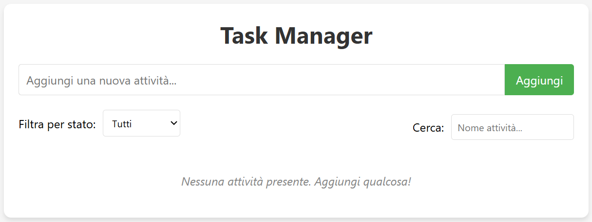
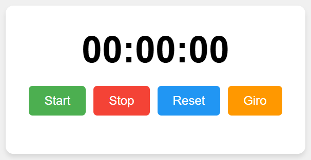
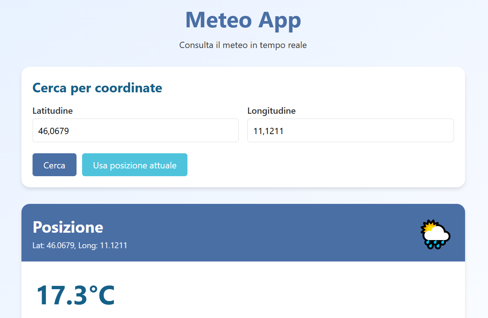

# Esame-Programmazione-WEB

Questo repository contiene i tre progetti sviluppati come parte del modulo formativo UF07:WEB. Ogni progetto è stato realizzato utilizzando tecnologie web standard (HTML, CSS e JavaScript).

## 📋 Indice

- [Panoramica](#panoramica)
- [Progetti](#progetti)
  - [1. Task Manager](#1-task-manager)
  - [2. Cronometro](#2-cronometro)
  - [3. Meteo App](#3-meteo-app)
- [Tecnologie Utilizzate](#tecnologie-utilizzate)
- [Installazione e Utilizzo](#installazione-e-utilizzo)
- [Documentazione Tecnica](#documentazione-tecnica)
- [Struttura del Repository](#struttura-del-repository)

## Panoramica

Questo progetto comprende tre applicazioni web distinte:

1. **Task Manager**: Un'applicazione per gestire attività con funzionalità di filtraggio e ricerca
2. **Cronometro**: Un cronometro digitale con pulsanti interattivi e funzionalità di registrazione dei tempi
3. **Meteo App**: Un'applicazione che recupera e visualizza dati meteo utilizzando API esterne

## Progetti

### 1. Task Manager



Un'applicazione per la gestione delle attività che consente agli utenti di tenere traccia delle proprie task.

#### Caratteristiche

- **Funzionalità base**:
  - Aggiungere nuove attività alla lista
  - Rimuovere attività dalla lista

- **Funzionalità avanzate**:
  - Modificare il nome delle attività esistenti
  - Gestire lo stato delle attività (Da fare, In corso, Completata)
  - Filtrare le attività in base al loro stato
  - Cercare attività specifiche tramite il nome

#### Come utilizzare

1. Inserisci il nome dell'attività nel campo di testo
2. Clicca su "Aggiungi" per creare una nuova attività
3. Usa i pulsanti accanto a ciascuna attività per modificarla, cambiarne lo stato o eliminarla
4. Usa i filtri nella parte superiore per visualizzare le attività in base al loro stato
5. Utilizza la barra di ricerca per trovare attività specifiche

### 2. Cronometro



Un cronometro digitale con un'interfaccia intuitiva che permette di misurare il tempo con precisione.

#### Caratteristiche

- **Funzionalità base**:
  - Pulsanti per avviare, fermare e resettare il cronometro
  - Visualizzazione del tempo nel formato MM:SS

- **Funzionalità avanzate**:
  - Pulsante "Giro" per salvare i tempi intermedi
  - Lista dinamica dei tempi salvati
  - Visualizzazione del tempo nel formato MM:SS:MS (millisecondi)

#### Come utilizzare

1. Clicca su "Start" per avviare il cronometro
2. Clicca su "Stop" per fermare il cronometro
3. Clicca su "Reset" per azzerare il cronometro
4. Clicca su "Giro" durante il funzionamento per salvare un tempo intermedio

### 3. Meteo App



Un'applicazione che mostra le condizioni meteorologiche attuali basate sulla posizione geografica.

#### Caratteristiche

- **Funzionalità base**:
  - Recupero dei dati meteo tramite coordinate geografiche (latitudine e longitudine)
  - Visualizzazione delle informazioni meteo essenziali (temperatura, umidità, precipitazioni)

- **Funzionalità avanzate**:
  - Recupero automatico delle coordinate del dispositivo dell'utente
  - Visualizzazione di icone meteo basate sul codice weather_code
  - Interfaccia utente intuitiva e responsive

#### Come utilizzare

1. Accedi all'applicazione (permetti l'accesso alla tua posizione per la funzionalità avanzata)
2. In alternativa, inserisci manualmente le coordinate di latitudine e longitudine
3. Visualizza i dati meteo correnti per la posizione selezionata

## Tecnologie Utilizzate

- **HTML5**: Struttura delle pagine web
- **CSS3**: Stile e layout delle applicazioni
- **JavaScript**: Logica di programmazione e interattività
- **API REST**: Comunicazione con servizi esterni (Open-Meteo API)
- **LocalStorage**: Memorizzazione locale dei dati
- **Geolocation API**: Rilevamento della posizione dell'utente

## Installazione e Utilizzo

Per utilizzare questi progetti localmente, segui questi passi:

1. Clona il repository:
   ```bash
   git clone https://github.com/NicolaPrete/Esame-Programmazione-WEB.git
   ```

2. Naviga nella directory del progetto:
   ```bash
   cd Esame-Programmazione-WEB
   ```

3. Apri il file index.html nella radice del progetto o naviga nelle singole cartelle dei progetti e apri i rispettivi file HTML:
   - `/Task-Manager/index.html`
   - `/Cronometro/index.html`
   - `/Meteo-app/index.html`

Non sono necessarie dipendenze esterne o configurazioni particolari per l'esecuzione di base dei progetti.

## Documentazione Tecnica

### Task Manager

Il Task Manager utilizza un pattern MVC semplificato:
- **Model**: Gestisce i dati delle attività in un array di oggetti
- **View**: Renderizza le attività nel DOM e gestisce l'interfaccia utente
- **Controller**: Coordina le interazioni tra il Model e la View

Le attività sono memorizzate come oggetti con la seguente struttura:
```javascript
{
  id: String,         // Identificatore univoco
  name: String,       // Nome dell'attività
  status: String      // Stato ('da-fare', 'in-corso', 'completata')
}
```

### Cronometro

Il cronometro utilizza la funzione `setTimeout()` per aggiornare il display ogni 10 millisecondi:

```javascript
/**
 * Aggiorna il contatore del cronometro
 * @returns {void}
 */
function updateTimer() {
  currentTime = Date.now() - startTime + elapsedTime;
  displayTime(currentTime);
  timerInterval = setTimeout(updateTimer, 10);
}
```

### Meteo App

La Meteo App recupera i dati meteo dall'API Open-Meteo:

```javascript
/**
 * Recupera i dati meteo dalle coordinate specificate
 * @param {Number} latitude - Latitudine geografica
 * @param {Number} longitude - Longitudine geografica
 * @returns {Promise<Object>} - Promise con i dati meteo
 */
async function fetchWeatherData(latitude, longitude) {
  const url = `https://api.open-meteo.com/v1/forecast?latitude=${latitude}&longitude=${longitude}&current=temperature_2m,relative_humidity_2m,precipitation,rain,cloud_cover,wind_speed_10m,weather_code`;
  
  const response = await fetch(url);
  return await response.json();
}
```

#### Weather Code Reference

I codici meteo (weather_code) sono definiti secondo lo standard WMO e rappresentano diverse condizioni meteorologiche:

| Codice | Descrizione                |
|--------|----------------------------|
| 0      | Cielo sereno               |
| 1-3    | Poco/parzialmente nuvoloso |
| 45-48  | Nebbia                     |
| 51-55  | Pioviggine leggera/moderata|
| 61-65  | Pioggia leggera/moderata   |
| 71-75  | Neve                       |
| 80-82  | Rovesci di pioggia         |
| 95-99  | Temporale                  |

## 📁 Struttura del Repository 

```
UF07-WEB-Progetti/
├── README.md                    # Questo file
├── screenshots/                 # Directory contenente gli screenshot
│   ├── task-manager.png
│   ├── cronometro.png
│   └── meteo-app.png
├── Task-Manager/               
│   ├── index.html
│   ├── style.css
│   └── script.js
├── Cronometro/                 
│   ├── index.html
│   ├── style.css
│   └── script.js
└── Meteo-app/                  
    ├── index.html
    ├── style.css
    └── script.js
```